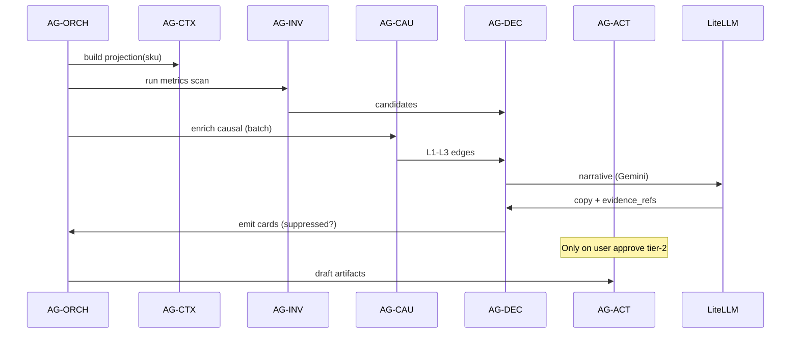

# Agent Model (Fixed Roster)

**V0.0.1:** No auto-spawn agents per tenant. Six roles, orchestrated jobs only.

---

## Roster

| Agent | ID | Role | Inputs | Outputs |
|-------|-----|------|--------|---------|
| Orchestrator | `AG-ORCH` | Route jobs, enforce integrity gates | Job queue, tenant health | Job plan, abort on suppress |
| Context | `AG-CTX` | Build `ContextProjection` | Graph + features + cache key | Projection JSON |
| Inventory | `AG-INV` | Deterministic candidates | `feat.sku_metrics_daily` | Raw decision candidates |
| Causal | `AG-CAU` | Association + DoWhy promotion | `feat.sku_week_matrix` | L1–L3 attachments |
| Decision | `AG-DEC` | Score, format, suppress | Candidates + causal + policy | Decision cards |
| Action | `AG-ACT` | Tier-2 drafts only | Approved card | PO draft, email draft |

---

## Orchestration flow

---

## Hard boundaries

| Agent | Must NOT |
|-------|----------|
| AG-INV | Call LLM; invent ₹ |
| AG-CAU | Promote L3 without refutation pass |
| AG-DEC | Exceed 7 cards/week; emit on failed integrity |
| AG-ACT | Write to Shopify/Unicommerce (Tier 3) |
| AG-CTX | Include other tenants' data |

---

## LLM routing

| Task | Model | Agent |
|------|-------|-------|
| Decision card copy, causal narrative | Gemini | AG-DEC |
| Chat rephrase, fast Q&A | Groq | Chat service |
| PO / supplier email draft | Gemini (schema-bound) | AG-ACT |

---

## Implementation note

Agents are **logical roles** — implement as Python modules + Dagster/Prefect ops, not separate LLM agents per step unless debugging.

See [stack-oss.md](./stack-oss.md) for LiteLLM config.
