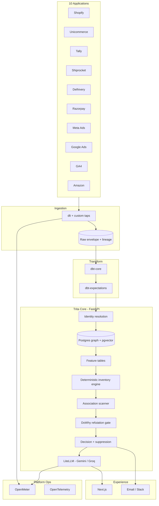

# System Architecture

## High-level flow

## Services

| Service | Tech | Host | Responsibility |
|---------|------|------|----------------|
| **web** | Next.js 14 | Vercel | Inbox, sources, inventory, reports, chat, settings |
| **api** | FastAPI | Render (paid, no cold start) | AuthZ, graph read APIs, decisions, chat proxy, webhooks |
| **ingest-worker** | Python + dlt | Render / container | Scheduled + webhook ingest |
| **transform** | dbt | Dagster/Prefect worker | Staging → gold |
| **analytics-jobs** | Python | Same orchestrator | Metrics, association, DoWhy, decision emit |
| **llm-proxy** | LiteLLM | Sidecar or dedicated | Gemini/Groq routing, budgets |
| **db** | Supabase Postgres | Supabase | Graph, raw, audit, auth |
| **storage** | Supabase Storage | Supabase | CSV uploads, exports |
| **metering** | OpenMeter | Cloud/self-host | Usage events |

## API boundaries

| Boundary | Rule |
|----------|------|
| **web → api** | Session/JWT; `tenant_id` from token only |
| **api → db** | RLS + app-layer filter; never trust body `tenant_id` |
| **ingest → db** | Service role scoped by `tenant_id` column; isolation tests |
| **llm-proxy** | No raw PII in logs; evidence refs only in prompts |
| **webhooks** | HMAC verify → idempotent enqueue |

## Auth model

- Supabase Auth (email/OAuth for pilot)
- JWT claims: `sub`, `tenant_id`, `role` (owner, member, viewer)
- OAuth tokens for connectors: encrypted at rest, server-only

## Caching

| Key | TTL | Invalidation |
|-----|-----|----------------|
| `ContextProjection(tenant, sku, hour)` | 1h | Inventory sync, new decision |
| Decision list (inbox) | Short | On emit/approve/reject |
| Integration health | 5m | On sync complete |

## Observability

- OpenTelemetry: trace ingest → dbt → decision emit
- Structured logs: `tenant_id`, `connector`, `pipeline_run_id`
- Alerts: sync SLA breach, quarantine spike, LLM budget 80%

## Environment strategy

| Env | Purpose |
|-----|---------|
| **local** | DuckDB + dbt dev; Supabase local or branch |
| **staging** | Synthetic tenants; red-team tests |
| **production** | Pilots + paying |

See [stack-oss.md](./stack-oss.md) for dependency versions (pin in repo when scaffolded).
