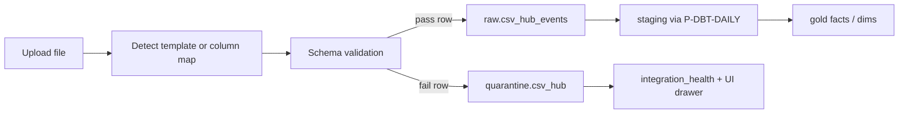

# Pipeline: P-INGEST-CSV-HUB

**Phase:** 1 (RM-1) — production, not a stub  
**Tier:** T1 — upload-triggered  
**Connector:** `C-CSV-HUB`  
**Feature:** `F-CONN-005` (alias `F-CSV-HUB`)

---

## Purpose

Ingest **any merchant CSV** into the same **raw envelope + quarantine + dbt** lifecycle as API connectors. No placeholder uploads; failed validation must surface in Sources health and quarantine, not silent drop.

---

## Data lifecycle



| Stage | Artifact | Rule |
|-------|----------|------|
| 1. Upload | Supabase Storage `{tenant_id}/csv/{upload_id}/` | Tenant-prefixed; virus-scan hook optional later |
| 2. Profile | `csv_upload` row: headers, row_count, `file_hash`, `mapping_profile` | Idempotent on `(tenant_id, file_hash)` — re-upload no-op |
| 3. Validate | Per-row against canonical schema for `entity_type` | Type, range, required fields; unknown columns allowed if mapped |
| 4. Raw | `raw.csv_hub_events` envelope | Same contract as [P-INGEST-SHOPIFY](./P-INGEST-SHOPIFY.md) |
| 5. Quarantine | `quarantine.csv_hub` | Hard fails + parse errors; counts in health API |
| 6. Transform | dbt staging → gold | Source-specific marts (Tally COGS, Amazon orders, etc.) |
| 7. Health | `feat.integration_health` | `healthy` / `degraded` / `failed` from SLA + quarantine rate |

---

## Raw envelope schema

```sql
-- raw.csv_hub_events
tenant_id uuid NOT NULL,
source text NOT NULL,           -- logical source: tally | amazon | generic | ...
external_id text NOT NULL,      -- stable row key: hash(tenant, source, entity_type, row_fingerprint)
entity_type text NOT NULL,      -- order_line | inventory_snapshot | unit_cost | shipment | payout | ...
payload jsonb NOT NULL,         -- canonical JSON after mapping (not raw CSV cells)
payload_hash text NOT NULL,
ingested_at timestamptz NOT NULL,
lineage jsonb                   -- { upload_id, file_name, mapping_profile, template_id?, row_number }
```

**Unique:** `(tenant_id, source, external_id, entity_type)`

---

## Schema validation

### Path A — Known template (auto-detect)

Match header row to `tpl_*` in [integrations.md](../context/integrations.md). If confidence ≥ threshold, apply fixed column map.

### Path B — Arbitrary CSV (column map)

User (or saved profile per tenant) maps **source column → canonical field** for chosen `entity_type`. Validation runs on canonical shape, not original header names.

### Canonical models (minimum fields)

| entity_type | Required canonical fields |
|-------------|---------------------------|
| `order_line` | `sku`, `order_id`, `qty`, `occurred_at` |
| `inventory_snapshot` | `sku`, `qty`, `as_of` |
| `unit_cost` | `sku`, `unit_cost`, `as_of` |
| `shipment` | `sku` or `awb`, `status`, `shipped_at` |
| `payout` | `reference_id`, `amount`, `settled_at` |

Optional fields stored in `payload` JSON; dbt coerces types.

### Validation rules

- Column types enforced (date, numeric, text)
- Referential warnings (unknown SKU) → row allowed with `lineage.warning`, not quarantine unless hard rule
- Hard fail → quarantine with `error_code`, `row_number`, `raw_snippet`
- File-level fail (no mappable entity) → upload `failed`; health **failed**

---

## Downstream routing

| Detected / declared source | `source` column | Gold target (via dbt) |
|--------------------------|-----------------|------------------------|
| `tpl_tally_*` | `tally` | `dim_sku.unit_cost`, inventory |
| `tpl_amazon_orders` | `amazon` | `fact_order_line` |
| `tpl_delhivery_*` | `delhivery` | `fact_shipment` |
| User map generic | `generic` or explicit | Per `entity_type` router model |

`F-CONN-003` (Tally) **must** use this pipeline — no separate ad-hoc Tally parser bypassing validation.

---

## API (target)

| Method | Path | Purpose |
|--------|------|---------|
| POST | `/api/v1/csv/upload` | Multipart file + optional `entity_type`, `template_id`, `column_map` |
| GET | `/api/v1/csv/templates` | List `tpl_*` + canonical field glossary |
| GET | `/api/v1/csv/uploads/{id}` | Status, quarantine summary, row counts |

---

## Acceptance (maps to VA-26)

- [ ] Yoga Bar: Tally template upload → gold `unit_cost` where columns present
- [ ] Yoga Bar: arbitrary headers + column map → ≥1 valid `order_line` in raw; bad rows in quarantine
- [ ] Re-upload same file → no duplicate raw rows (hash idempotency)
- [ ] Sources drawer shows quarantine count and last sync after upload

---

## Forbidden

- UI-only upload with no raw write
- Skipping validation “for speed”
- Connector-specific CSV parsers that bypass envelope/quarantine
