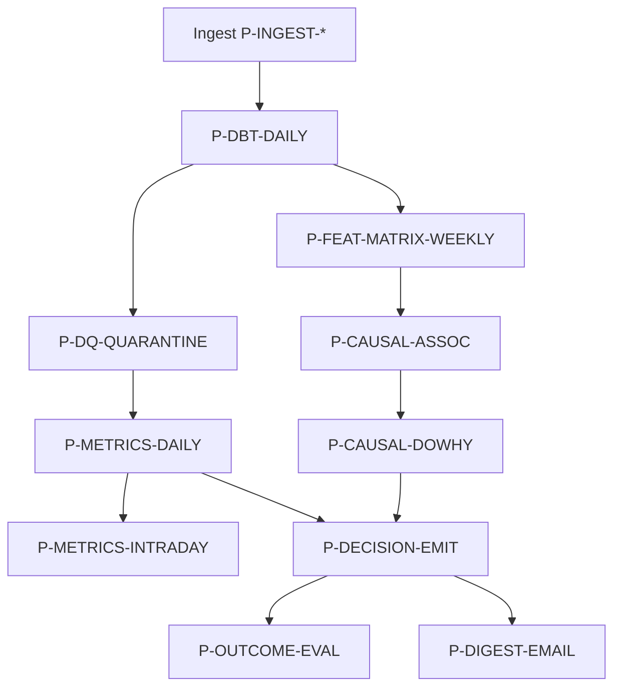

# Pipeline Registry

Orchestrator: **Dagster** (ADR-001 Accepted). All jobs must be **idempotent** by Phase 4. **No stub pipelines** — `planned` means spec exists; ship must satisfy full raw → quarantine → dbt path.

**Status:** `planned` | `active` | `deprecated`

---

## Ingest pipelines

| ID | Schedule | Phase | Source | Output | Spec |
|----|----------|-------|--------|--------|------|
| P-INGEST-SHOPIFY | 4h + webhook | 0 | Shopify | `raw.shopify` | [P-INGEST-SHOPIFY.md](./P-INGEST-SHOPIFY.md) |
| P-INGEST-CSV-HUB | on upload | 1 | CSV hub | `raw.csv_hub_events` | [P-INGEST-CSV-HUB.md](./P-INGEST-CSV-HUB.md) |
| P-INGEST-UNICOMMERCE | 8h | 1 | Unicommerce | `raw.unicommerce` | planned |
| P-INGEST-SHIPROCKET | 12h | 1 | Shiprocket | `raw.shiprocket` | planned |
| P-INGEST-RAZORPAY | 24h | 1 | Razorpay | `raw.razorpay` | planned |
| P-INGEST-DELHIVERY | 24h | 3 | Delhivery | `raw.delhivery` | planned |
| P-INGEST-META | 24h | 3 | Meta Ads | `raw.meta_ads` | planned |
| P-INGEST-GOOGLE-ADS | 24h | 3 | Google Ads | `raw.google_ads` | planned |
| P-INGEST-GA4 | 24h | 4 | GA4 | `raw.ga4` | planned |
| P-INGEST-AMAZON | on upload / 24h | 4 | Amazon | `raw.amazon` | via P-INGEST-CSV-HUB + API planned |
| P-WEBHOOK-SHOPIFY | event | 0 | Webhook | queue → P-INGEST | inline P-INGEST |

---

## Transform & DQ

| ID | Schedule | Phase | Input | Output |
|----|----------|-------|-------|--------|
| P-DBT-DAILY | after ingest batch | 0 | raw.* | staging.*, gold.* |
| P-DQ-QUARANTINE | with dbt | 1 | staging | quarantine.* + health mart |

---

## Analytics & decisions

| ID | Schedule | Phase | Status | Input | Output |
|----|----------|-------|--------|-------|--------|
| P-METRICS-INTRADAY | 4h | 1 | planned | gold inventory, orders | `feat.sku_metrics_daily` |
| P-METRICS-DAILY | nightly | 1 | **active** | gold + identity | `feat.sku_metrics_daily` (Dagster `metrics_dbt_op`) |
| P-FEAT-MATRIX-WEEKLY | weekly | 3 | gold + ads + logistics | `feat.sku_week_matrix` |
| P-CAUSAL-ASSOC | weekly | 3 | matrix | association edges |
| P-CAUSAL-DOWHY | weekly | 3 | candidates | L2/L3 edges | [P-CAUSAL-DOWHY.md](./P-CAUSAL-DOWHY.md) |
| P-DECISION-EMIT | after metrics | 2 | **active** | feat metrics | `public.decisions` (Dagster `decision_emit_op`) |
| P-OUTCOME-EVAL | daily | 2 | decisions + metrics | outcome rows |

---

## Platform & notify

| ID | Schedule | Phase | Purpose |
|----|----------|-------|---------|
| P-ORCH-DAILY-SHELL | manual | 0 | ingest → dbt chain — [spec](./P-ORCH-DAILY-SHELL.md) |
| P-LLM-PROXY | always on | 0 | LiteLLM service |
| P-METER-EXPORT | 5m | 4+ | OpenMeter — **deferred** [P-METER-EXPORT.md](./P-METER-EXPORT.md) |
| P-DIGEST-EMAIL | cron | 3 | Email digest |
| P-DIGEST-SLACK | cron | 3 | Slack digest |
| P-IDENTITY-REFRESH | nightly | 1 | SKU alias suggestions |

---

## Pipeline dependency DAG

---

## SLA & alerting

| Pipeline | Max runtime | Alert if |
|----------|-------------|----------|
| P-INGEST-SHOPIFY | 30m | failed 2x consecutive |
| P-DBT-DAILY | 60m | >2h since last success |
| P-DECISION-EMIT | 15m | 0 cards when metrics expect |
| P-CAUSAL-DOWHY | 120m | OOM / timeout |

---

## Idempotency keys

| Pipeline | Key |
|----------|-----|
| Ingest | `(tenant_id, source, external_id)` |
| Decision emit | `(tenant_id, type, sku_id, iso_week)` |
| Digest | `(tenant_id, date, channel)` |
