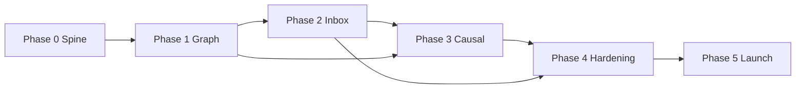

# 16-Week Roadmap Overview

**Goal:** Production V0.0.1 with 1 paying customer @ ₹10K+, proven inventory decision, honest 10-app Sources UI.

---

## Timeline

| Phase | Weeks | Theme | Exit headline |
|-------|-------|-------|---------------|
| [0](./phase-0-spine.md) | 1–2 | Spine | Shopify E2E ingest + health |
| [1](./phase-1-six-apps-graph.md) | 3–5 | Six apps + graph | Data Health Card accurate |
| [2](./phase-2-inventory-inbox.md) | 6–8 | Inventory inbox | Pilot accepts/rejects ≥1 card |
| [3](./phase-3-causal-proactive.md) | 9–11 | Causal + proactive | Card with L2/L3 driver |
| [4](./phase-4-ten-apps-hardening.md) | 12–14 | Ten apps + hardening | All 10 in Sources UI |
| [5](./phase-5-launch.md) | 15–16 | Launch | First paying customer |

---

## Dependency graph (phases)

---

## Parallel workstreams

| Stream | Phases | Owner skill |
|--------|--------|-------------|
| **Data plane** | 0–4 | dlt, dbt, identity |
| **Core API** | 0–3 | FastAPI, decisions |
| **Web UX** | 1–5 | Next.js |
| **Causal** | 3–4 | DoWhy, association |
| **Platform** | 0–5 | OpenMeter, OTEL, CI |
| **Commercial** | 5 | Billing, legal, pilots |

---

## Feature delivery by phase

| Phase | Feature IDs (see REGISTRY) |
|-------|----------------------------|
| 0 | F-PLAT-*, F-CONN-HEALTH, F-INGEST-SHOPIFY, F-GRAPH-SHELL |
| 1 | F-CONN-001..006, F-ID-*, F-METRICS-*, F-REPORT-HEALTH |
| 2 | F-INBOX-*, F-DEC-*, F-AUDIT-*, F-REPORT-INV-*, F-DRAFT-* |
| 3 | F-CAUSAL-*, F-PROACTIVE-*, F-CHAT-*, F-CONN-007..009 |
| 4 | F-CONN-010, F-GA4, F-LOAD-*, F-REDTEAM-* |
| 5 | F-BILLING-*, F-LEGAL-*, F-ONBOARD-* |

---

## Risk watch (weekly)

| Risk | Phase to mitigate |
|------|-------------------|
| Integration death march | 0–1 factory; 6 live first |
| Trust death (wrong reorder) | 2 blocked cards, Tier 3 off |
| Causal overclaim | 3 policy + UI labels |
| Alert fatigue | 2 suppression |
| LLM cost | 0 OpenMeter + budgets |
| Tenant leakage | 0 isolation CI |

---

## Milestones vs launch gate

| Milestone | Week | Launch gate item |
|-----------|------|------------------|
| First ingest | 2 | Idempotent ingest |
| Graph populated | 5 | 6+ sources production |
| First decision | 8 | Inbox + audit |
| Causal on card | 11 | L1+ on card type |
| 10 sources visible | 14 | 10 in Sources UI |
| Paid customer | 16 | ≥1 @ ₹10K+ |

Detail: [../checklists/LAUNCH-GATE.md](../checklists/LAUNCH-GATE.md)
